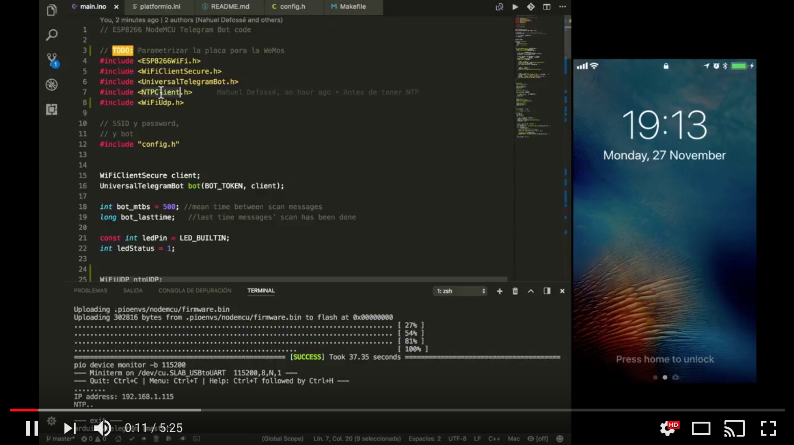

# Cliente de Telegram con NTP


Este es un cliente de Telegram para Arduino, sobre ESP8266 es 
su versión NodeMCU.

.

La configuración de SSID, clave y bot de telegram no está versionada
y se debe agregar en `src/config.h`. Un ejemplo del archivo 
es el siguiente:

```c
// config.h

#define SSID "xxx"
#define PASSWORD "xxxx"
#define BOT_TOKEN "123456789:xxxxxxxxxxxxxxxxxxxxxxxxxxxxxxxxxxx"

```

Para obtener un ID de bot, en Telegram, conectarse buscar al `botfather` y crear un nuevo bot.
Este engregará el **token**


## Explicación en Video del Proyecto

Hice un pequeño video para explicar como funciona el archivo [src/main.ino](src/main.ino)

[](https://www.youtube.com/watch?v=kQ5DDBh-np4)